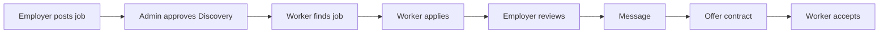

# Cross-Role Matrix — Routes, Tables & Actions

Maps each marketplace bridge across **Employer**, **Worker**, and **Admin**.

## Hiring lifecycle

## Feature bridges

| Feature | Tables | Employer | Worker | Admin |
|---------|--------|----------|--------|-------|
| Jobs | `jobs`, `job_posts` view | `/employer/jobs/*` | `/worker/jobs/*` | `/admin/jobs` |
| Applications | `applications`, `application_stage_history` | `/employer/jobs/[id]/applicants` | `/worker/applications` | `/admin/applications` |
| Messaging | `chat_threads`, `chat_messages` | `/employer/messages` | `/worker/messages` | `/admin/moderation` |
| Contracts | `contracts` | `/employer/hired`, `/employer/contracts/[id]` | `/worker/contracts` | `/admin/contracts` *(new)* |
| Interviews | `interviews` | `/employer/interviews` | `/worker/interviews` | — |
| Disputes | `disputes` | `/employer/support` *(new)* | `/worker/settings` report | `/admin/disputes` |
| Verification | `verification_documents` | — | `/worker/verification` | `/admin/identity` |
| Billing | `billing_plans`, `employer_subscriptions` | `/employer/settings/account` | — | `/admin/billing-ops`, `/admin/revenue` |
| Reviews | `employer_testimonials` | `/employer/reviews` | `/worker/profile` | — |
| Talent | `profiles`, `worker_skills` | `/employer/talent` *(new)* | `/worker/profile` | `/admin/users/[id]` |
| Notifications | `notifications` | `/employer/notifications` | `/worker/notifications` | `/admin/notifications` |
| CMS | `faqs`, `testimonials`, `page_content` | `/employer/pricing` | — | `/admin/settings/pages` |

## Shared server actions

| Action file | Employer | Worker | Admin |
|-------------|----------|--------|-------|
| `messaging.ts` | send/read threads | send/read threads | read metadata |
| `applications.ts` | status updates | — | optional override |
| `job-application.ts` | — | apply | — |
| `notifications.ts` | mark read | mark read | mark read |
| `onboarding.ts` | company wizard | profile wizard | — |
| `auth.ts` | signup/login | signup/login | login + MFA |

## Entitlement touchpoints

| Employer action | Worker impact | Admin visibility |
|-----------------|---------------|------------------|
| Discovery tier | anonymous preview, no messaging | job queue |
| Applicant cap | can apply; employer sees cap | applications list |
| Job limit | fewer jobs on board | billing-ops |
| Plan upgrade | messaging unlocks | revenue MRR |
